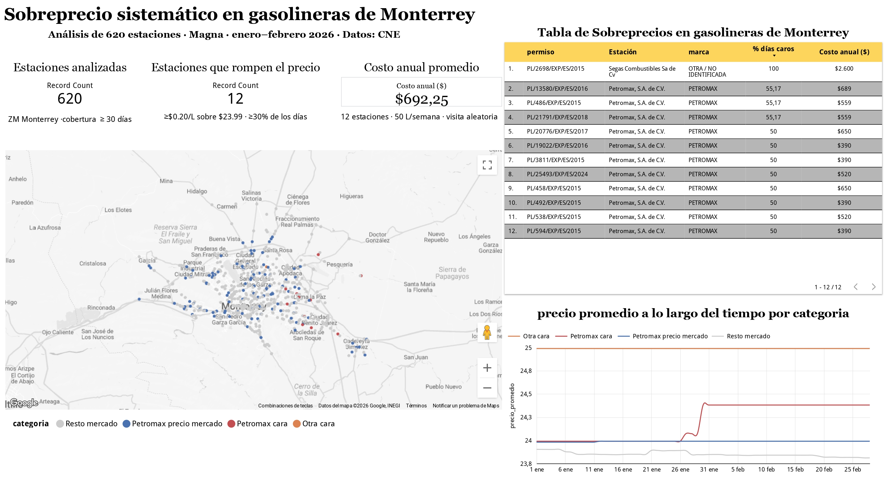
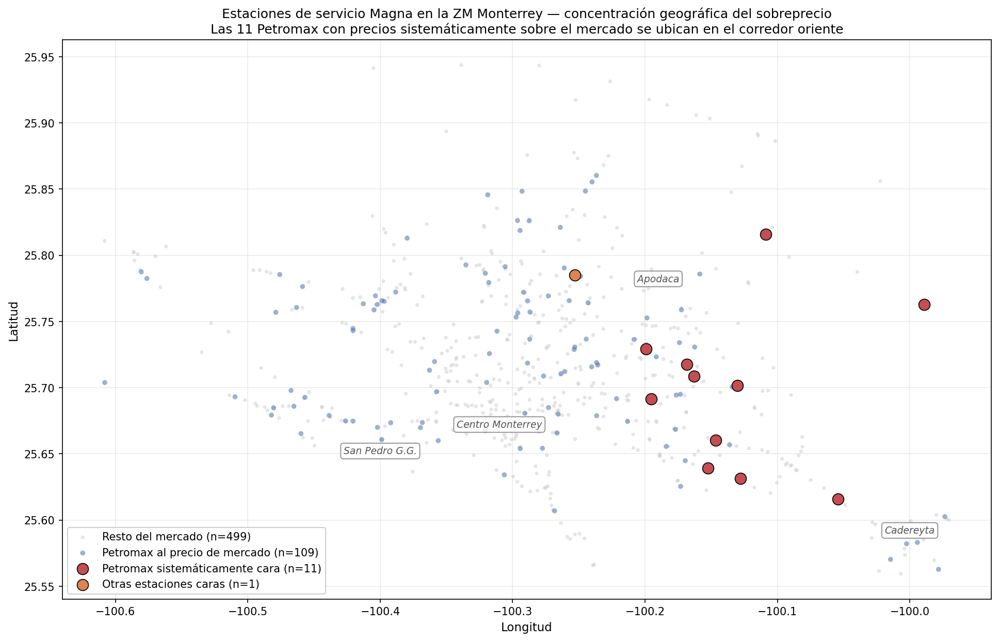
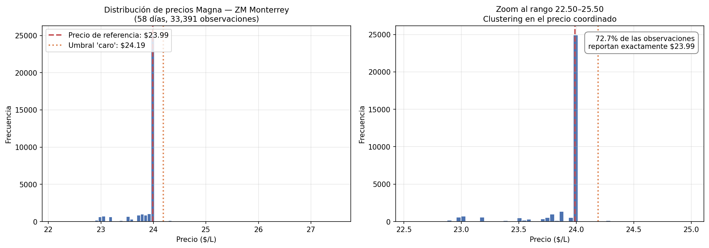
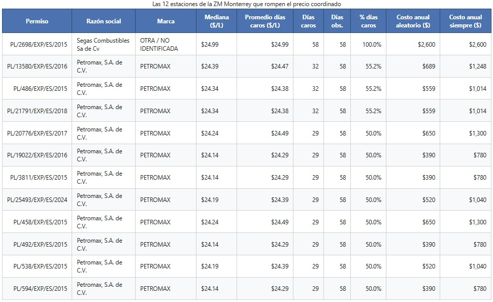
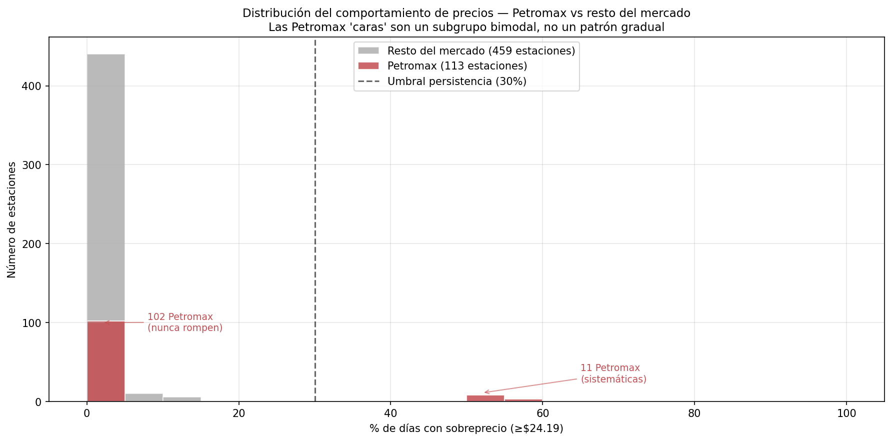
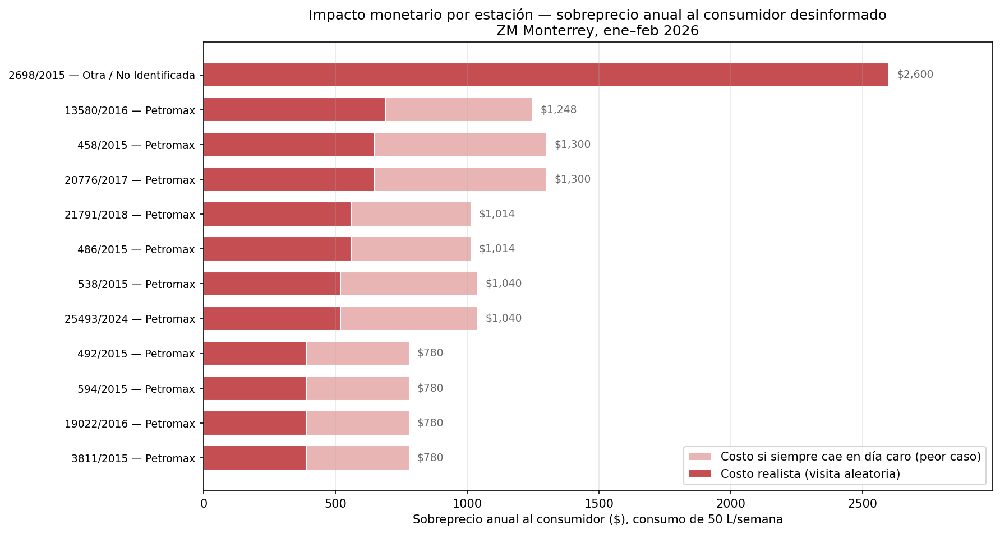

# Sobreprecio sistemático en gasolineras de Monterrey

> Análisis exploratorio de 620 estaciones de servicio en la Zona Metropolitana de Monterrey que identifica un subgrupo de 12 estaciones cobrando Magna consistentemente por encima del precio coordinado del mercado, con un sobreprecio anual de hasta $2,600 al consumidor desinformado.

**Dashboard construido en Google Looker Studio:**





---

## Pregunta de negocio

> ¿Qué gasolineras de la ZM Monterrey cobran Magna ≥$0.20/L sobre el precio de referencia ($23.99) en al menos el 30% de los días observados, y cuánto le cuesta al consumidor desinformado al año?

**Cliente hipotético:** app de comparación de precios al consumidor o medio de periodismo de datos.

---

## Hallazgos principales

**1. El mercado opera con precios coordinados, no con fijación independiente.**
El 72.7% de las observaciones en la ZM Monterrey reporta exactamente $23.99/L. A nivel nacional el clustering es de 41%. Esto no es competencia de mercado libre — es comportamiento de seguimiento de precio.



**2. Solo 12 estaciones rompen el precio sistemáticamente.**
De 572 estaciones con cobertura suficiente, 31 reportan algún día con precio elevado, pero solo 12 lo hacen en ≥30% de los días observados. El criterio de persistencia separa casos aislados de comportamiento deliberado.



**3. Patrón bimodal en la marca Petromax.**
De 120 estaciones Petromax en la ZM, 102 nunca rompen el precio y 11 lo rompen consistentemente (~50–55% de los días). **Cero estaciones en zonas intermedias.** Esto descarta la hipótesis de "marca cara" — es un subgrupo específico de Petromax, no la marca completa.



**4. Las 11 Petromax caras se concentran geográficamente en el corredor oriente.**
Todas se ubican en Apodaca–Guadalupe–Juárez–Cadereyta. Longitud media −100.13 vs −100.30 del resto (~17 km al este del centro). **Cero estaciones en San Pedro Garza García**, la zona de mayor poder adquisitivo de la ZM.

**5. Impacto monetario al consumidor.**
Para un consumidor con consumo de 50 L/semana (52 semanas/año):

| Escenario | Petromax caras | Segas Combustibles |
|---|---|---|
| Visita aleatoria (realista) | $390–$689/año | $2,600/año |
| Siempre cae en día caro (peor caso) | $780–$1,300/año | $2,600/año |



---

## Metodología

**Datos:**
- Precios oficiales: [CNE — Petrolíferos en datos.gob.mx](https://datos.gob.mx/dataset/petroliferos) (enero–febrero 2026, 33,391 observaciones).
- Catálogo de estaciones: XML público de SENER con 14,745 estaciones nacionales y coordenadas geográficas.
- Permisos vigentes: CSV oficial CNE.

**Ventana temporal:** 58 días contiguos (enero + febrero 2026). Diciembre 2025 no disponible públicamente por rezago de 3–4 meses en archivos CNE.

**Filtro geográfico:** Bounding box de la Zona Metropolitana de Monterrey. 620 estaciones en el universo final tras filtrar coordenadas válidas y cobertura mínima (≥30 días reportados).

**Precio de referencia:** $23.99/L — modal nacional y local. Se descartó la mediana de vecindad de 3 km porque el clustering del mercado hace ambos métodos equivalentes.

**Umbral de sobreprecio:** $0.20/L absoluto (≥$24.19/L). Equivale a $520/año adicionales para un consumidor de 50 L/semana — monto perceptible por el bolsillo de un hogar mexicano.

**Criterio de persistencia:** ≥30% de los días observados. El "codo natural" de la distribución bimodal separa estaciones sistemáticas (≥50% días) de casos aislados (<10% días).

**Inferencia de marca:** Regex sobre razón social. Identifica ~9 marcas. La categoría "OTRA / NO IDENTIFICADA" en este análisis corresponde a Segas Combustibles.

---

## Limitaciones

1. La ventana de 58 días es suficiente para detectar persistencia, pero no estacionalidad anual.
2. Diciembre 2025 no disponible públicamente al momento del análisis.
3. La marca se infiere por regex sobre razón social; estaciones con razón social genérica pueden no clasificarse correctamente.
4. Los datos son precios promedio diarios. Variaciones intra-día no son observables.
5. El filtro de ZM es bbox geográfico, no spatial join con polígonos INEGI. Decisión de scope.
6. Inconsistencia de nomenclatura entre meses para subproductos (`diesel_automotriz` vs `diésel automotríz`) — resuelta en limpieza.
7. 6 estaciones marcadas en Nuevo León con coordenadas fuera del estado (errores de captura en la fuente).
8. Sin datos de volumen de venta. El impacto agregado al mercado no es calculable.
9. La hipótesis sobre la causa del corredor oriente (clientela industrial, menor competencia local, etc.) **no es validable** con este dataset.

---

## Estructura del repositorio

```
gasolineras-mty/
├── README.md
├── .gitignore
├── requirements.txt
├── data/
│   └── processed/                       # Datos limpios y figuras
│       ├── estaciones_zm_monterrey.parquet
│       ├── magna_zm_diario.parquet
│       ├── estaciones_caras_candidatas.parquet
│       ├── fig01_clustering.png
│       ├── fig02_bimodal_petromax.png
│       ├── fig03_mapa_geografico.png
│       ├── fig04_impacto_monetario.png
│       ├── tabla_12_estaciones.png
│       └── looker_exports/              # CSVs para el dashboard
├── notebooks/
│   ├── 01_eda.ipynb                     # Exploración, validación, ajuste de umbrales
│   └── 02_analisis.ipynb                # Hallazgos finales con narrativa
└── scripts/
    ├── explorar_datos.py
    └── regenerar_evolucion.py
```

---

## Stack técnico

- **Lenguaje:** Python 3.12
- **Análisis y limpieza:** pandas, numpy
- **Geoespacial:** geopandas, shapely, pyproj
- **Visualización:** matplotlib, seaborn
- **Almacenamiento intermedio:** Apache Parquet (pyarrow)
- **Entorno:** Jupyter Notebook
- **Dashboard:** Google Looker Studio

---

## Cómo reproducir

```bash
# Clonar y entrar
git clone https://github.com/AlejandroPerez17/gasolineras-mty.git
cd gasolineras-mty

# Entorno virtual
python3 -m venv venv
source venv/bin/activate   # En Windows: venv\Scripts\activate

# Dependencias
pip install -r requirements.txt

# Descargar datos crudos a data/raw/
# (URLs en notebooks/01_eda.ipynb, primera celda)

# Lanzar Jupyter
jupyter notebook
```

Abrir `notebooks/01_eda.ipynb` y ejecutar en orden.

---

## Autor

**Osiel Alejandro Pérez Barroso**
Estudiante de Ingeniería en Tecnologías de Software, UACAM · Analista de Datos Jr. en formación

- 📧 [osiel.8@hotmail.com](mailto:osiel.8@hotmail.com)
- 💼 [LinkedIn](https://www.linkedin.com/in/osiel-alejandro-perez-barroso-77873333a/)
- 💻 [GitHub](https://github.com/AlejandroPerez17)

---

*Análisis realizado en mayo de 2026 con datos públicos de la Comisión Nacional de Energía (CNE) de México. Sin afiliación comercial con ninguna estación, marca o empresa mencionada.*